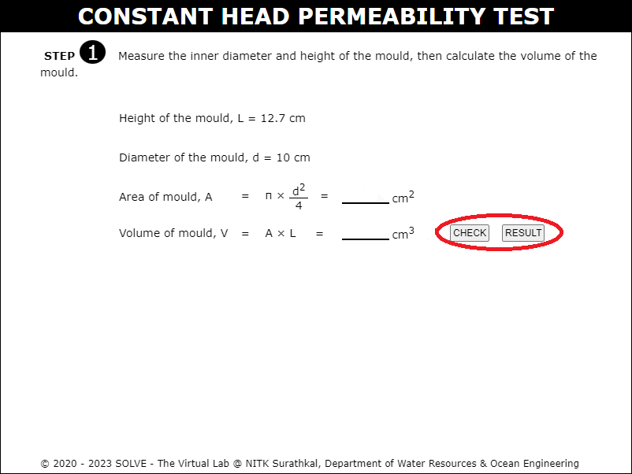

#### The following procedure steps will be followed on the simulator

1.	Click on the simulation button and following page will be displayed. Hover over the description button to get a brief explanation about the experiment. Then click on "Next Button" to proceed. 
 

2. Click on the scale to measure the diameter and height of the mould. Then determine the area and volume of the mould and click on the "Next Button". 
  
 

3. Click on the sealing gasket and the porous stone to place it inside the base plate and click on the "Next Button". 
  
 

4. Click on the mould and fix it by bolt and nut mechanism. 
 

5. Click on the filter paper to place it inside the permeameter and click on the "Next Button". 
 

6. Click on the trowel to collect the soil sample and pour into the mould, and click on the tamping rod to compact the soil and continue the same for the 3 layers and click on the "Next Button". 
 

7. Click on the filter paper and the porous stone to place it above the permeameter and click on the "Next Button". 
 

8. Click on the top plate and tighten the screws. 
 

9. Answer the formative questions to move forward in the simulation and click on the "Next Button". 
 

10. Click on the pipe to connect it to the outlet of the permeameter, click on the air release valve to open it. 
 

11. Click on the water valve to allow the water to flow inside the permeameter. Click on the water valve again to stop the water flow once water flows out  of the air release valve. 
 

12. Click on the water valve and allow the water to flow inside the permeameter keeping a constant head of water. 
 

13. Note down the volume of water collected for time t and click on the "Next Button". 
 

14. Calculate the average volume of water and coefficient of permeability of given soil sample using the collected data. 
 
