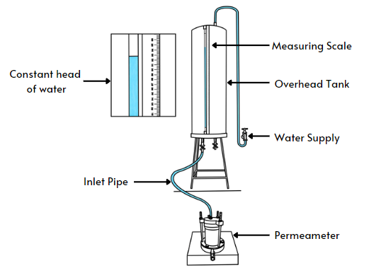

### INTRODUCTION

### Darcy’s Law:

Darcy showed experimentally that the rate of flow of water flowing through a soil medium of unit cross sectional area is directly proportional to the imposed hydraulic gradient.

q	= Rate of flow of water

A	= Cross sectional area of soil

i	= Hydraulic gradient

Therefore, the rate of flow of water divided by cross sectional area is directly proportional to hydraulic gradient.

 

To take out the proportionality from the equation, a constant is inserted into the equation which is called <strong>'Darcy's coefficient of permeability'</strong> or <strong>'coefficient of permeability'</strong> or <strong>'permeability'</strong>.

 

Therefore permeability can be defined as the property of soil which indicates the ease through which the water will flow / percolate through the continuously linked pore spaces of the soil. Or, Permeability can also be defined as the ratio between rate of flow of water to that of the product of cross sectional area and hydraulic gradient. 

 

The major factors on which permeability depends are the grain size of the soil particles, the properties of the pore fluid, the void ratio of soil, the shapes and arrangement of pores and the degree of saturation.

In laboratory, permeability of soil is found by any of the following two experiments:

#### 1. Constant head permeability:

In this experiment, a constant head of water is maintained in the overhead tank so that the pressure of water remains constant at all times. This experiment is usually carried out for coarse grained soils where the permeability of the soils are higher.

#### 2. Variable head permeability:

In this experiment, a stand pipe is connected to the permeameter which supplies the water. This experiment is usually carried out for fine grained soils or cohesive soils where the permeability of water is very low.

Constant Head Permeability Test Setup

 

##### Formula to calculate permeability in constant head permeability test :

 

<ul style="list-style: none;"">
<li>k	= Coefficient of permeability,</li> 
<li>Q	= Total quantity of water collected in time t,</li> 
<li>L	= Length of the sample,</li> 
<li>t	= Duration of water collected,</li> 
<li>h	= Constant head of water</li>
</ul>

 

|Type of soil | Permeability (cm/s)|
|:--|:--:|
|Gravel|1|
|Coarse sand|1 to 0.1|
|Medium sand|10-1 to 10-2|
|Fine sand|10-2 to 10-3|
|Silty sand|10-3 to 10-4|
|Silt|10-5 |
|Clay|10-7 to 10-9|

   
